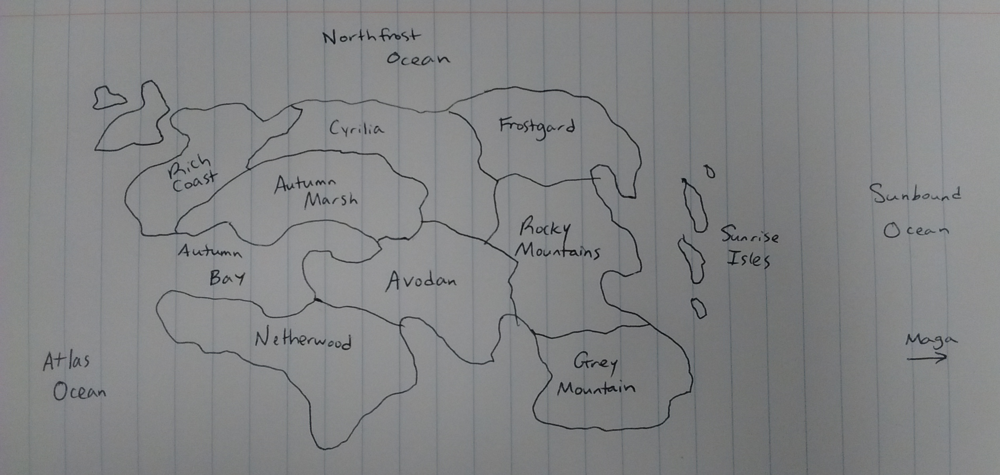

Geography
=========
Maga is a large island chain, far east of the continent Honstrad. The ocean Maga sits in is called the Sunbound Ocean.

Honstrad
--------
Honstrad is a continent that lies between the Northfrost Ocean, Sunbound Ocean, and Atlas Ocean. Before the colonization of Maga, there were nine regions in Honstrad called Rich Coast, Cyrilia, Avodan, Rocky Mountains, Autumn Marsh, Frostgard, Netherwood, Grey Mountain, and Sunrise Isles. Each region is the homeland of nine races, respectively: Kelts, Bulgars, Westforts, Vedes, Magafel, Noctfel, Rubefel, Draculs, and Iavols.

Underground
-----------
Beneath the surface, there are civilizations of various races living in the earth. Based on how deep you are, there will be different species one encounters.

### Near Neath

For the first few hundred feet exists the Near Neath. This is where Goblins and other common underground races tend to live. Most do not stay permanently here, and make frequent trips to the surface.

### Middle Neath

Less common underground races live in the Middle Neath, and rarely travel to the surface.

### Far Neath

The Far Neath is part of the crust that is kept warm by the planet's mantle. As one goes deeper and deeper, the earth becomes unhospitably warm and contains fewer and fewer living things.

### Demonia

Demonia refers to the various realms of the Demon Lords, located farther underground than the mantle. Often times, Demonia is simply used as a swear. For example, "What in Demonia happened to you?" could be a common expression.
