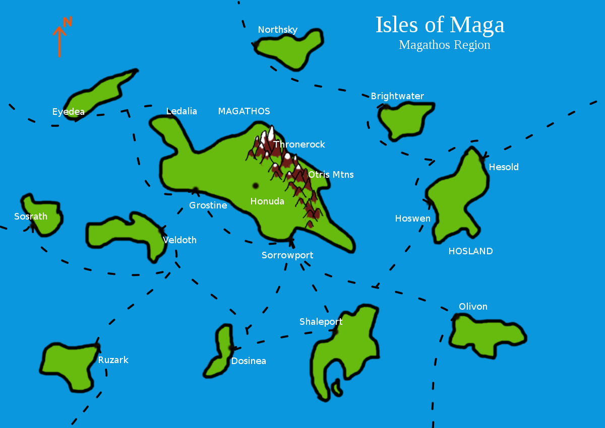
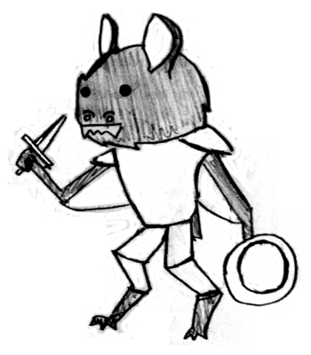

The Isles of Maga
=================

The history of Maga is scattered and mysterious, but here is what is common knowledge. The date of this information is 5E308 (the 308th year of the fifth era, which began with the founding of the Modern Republic).

Physical Geography
------------------
Maga is an island chain spanning a tremendous area of nearly one million square kilometers (approximately the size of Kazakhstan) and contains thousands of islands if not more. The islands all have a tropical climate, although the flora and fauna varies somewhat between subregions. The various subregions vary in the length and severity of their wet and dry seasons. The largest island of Magathos has a mountain range called the Otris Mountains, the peaks of which are tall enough to be snow-capped. As a result of the difference of elevation, this island has alpine grasslands, forests, and tundra.

The Isles of Maga are in the Sunbound Ocean, far away from any mainland continent, although some exist. Historically there has been trade with the closest mainland in the west, called Honstrad, but in recent history travel has been cut off.

Political Geography
-------------------
Maga is governed by the Modern Republic. Clusterings of islands form a district; the district that gets the most attention in this document is the Capital District, which contains the capital and nearby islands.

The capital of the country is Thronerock, located in the Otris Mountains in Magathos. Other cities in Magathos are Honuda, Grostine, Ledalia, and Sorrowport. Nearby major islands are Veldoth, Ruzark, Eyedea, Northsky, Olivon, Hosland, Brightwater, and Shaleport. Each island has at least one port city, which is the center of most trade. The cities on Magathos also have a significant inland trade.

Magathos has an area of 5,000 square kilometers, and is the largest island in Maga. The other islands listed vary in size, and are anywhere from 1,000 to 4,000 square kilometers. There are other important trade islands that are much smaller, being no more than 100 or so square kilometers.

Although the inside of the Otris Mountains are very developed by Dwarves, the outside of the mountains have not largely been touched by civilization. A great number of unique wildlife make their homes there, as well as some unintegrated beast races.

Political System
----------------
The Modern Republic has a president as head of state. The representatives are chosen by the Electorate, who are the descendants of the revolutionaries who violently overthrew the Elven Kingdoms that preceded the Republic. The majority of the Electorate are Dwarves, with a significant minority of Humans and Halflings. Elves represent a very small minority of the Electorate; less than 1% are Elves, who are the descendants of those Elves that rebelled against their own kingdom. None of the beast races (Lacertines, Felidines, Corvidines, and Vespertines) have any members in the Electorate. As of 5E308, the president is Grulth Skullstone, an elderly Dwarf who personally participated in the establishing of the Republic in a minor role.

Technology
----------
The technology is around that of the European middle ages, although there is room for flexibility. For example, it is possible that gunpowder has been discovered recently leading to the invention of cannons and guns. There are also magical constructs, which are mindless machines that were animated by magic.

Religion
--------
The "good" religion in Maga is monotheistic, worshipping the deity called Gora. However, Gora does not actively perform miracles, and the power of Clerics, like Magic-Users, comes from their life energy rather than a blessing from Gora. In fact, there is no physical evidence that Gora exists, but rather his existence is based on an oral tradition dating thousands of years that eventually became a written tradition and organized into churches.

However, there are a large number of "evil" religions in Maga, each serving a Demon Lord. Unlike Gora, the existence of Demon Lords is undeniable and apparent. Although the worship of the Demon Lords is forbidden culturally and legally, they all have their own share of worshippers. Demon Lords are considered evil compared to Gora, and while they generally tend to be misanthropic, some actually follow a more complex grey morality. Furthermore, all the beast races traditionally worship a patron or matron Demon Lord rather than Gora (although some do worship Gora), and have a much more positive perception of the Demon Lord they follow. Some trades also have their share of followers with a similar view as the beast races: there are merchants who worship Opulentum, and sailors who worship Nautarum, for example.

A Cleric, then, is permitted to serve a Demon Lord as a patron/matron deity, but they cannot do so openly. As stated earlier, the power of Clerics does not come from a blessing, but from their life-energy.

Demon Lords all have their own region in the land of Demonia. Demonia is located deep underground, far deeper than any mortal could possibly go. The different regions are called Baronies of Demonia. Each Lord also has their own kind of demons that fit their nature.

These are some of the major Demon Lords (feel free to make new ones):

- Pastorum, Patron of Ghosts (worshipped by Corvidines). His demons are called Nonces, which are the ghosts of deceased sentient races. Upon death, a Nonce retains the memories of its life, but loses its sense of identity. His Barony is called Arcadia, a land of rolling hills and meadows that are perpetually lit by moonlight. His appearance is of a human skeleton in a robe, with the skull of a bull. In one hand he holds a shepherd's crook, and in the other hand he holds a box lantern.
- Umbrarum, Matron of Shadows (worshipped by Vespertines)
- Solum, Matron of Purity (worshipped by Felidines)
- Vitarum, Matron of the Woods (worshipped by Lacertines)
- Primarium, Patron of Disaster. His demons are called Elementals, which are intelligent beings made of fire, water, air, or earth. His Barony is called Tormentia, a region where the land never sits still. There are constant earthquakes and landslides, incredible gusts and lightning, and tremendous fires and tsunamis. His appearance is as chaotic as his domain: he is a mixture of flames, water, wind, and rock. He does not hold a constant shape, but typically presents himself as humanoid.
- Morborum, Patron of Plague
- Opulentum, Patron of Deals
- Nautarum, Matron of the Seas
- Terror, Patron of Fear
- Nefastum, Matron of Thuggery
- Ultimatum, Patron of the End Times

Races/Species
-------------
Aside from the four human-like races (Dwarves, Elves, Halflings, and Humans), there are four beast races: Lacertines (lizard people), Felidines (cat people), Corvidines (crow people), and Vespertines (bat people). Because the four non-beast races already have details in the BFRPG rules, they are mainly described in terms of their political relationships. The beast races have full descriptions for player characters.

### Dwarves

Politically, Dwarves are the most powerful race in Maga, having initiated the revolution that overthrew the Elven Kingdoms and established the Modern Republic, and now occupy more than 50% of the Electorate. Their rule is heavy-handed, but not outrageously so to most citizens of Maga who know of the horror stories from the Elven Kingdoms. Due to their political status, Dwarves have somewhat of a privileged position in society, which some other races are wary of.

### Elves

While the Dwarves are celebrated in Maga, the Elves are shunned. Once ruling several glorious kingdoms during the Fourth Era, known as the Elven Kingdoms, since the revolution they have been completely disgraced. The Elven Kingdoms were famous for their cruelty towards non-Elves, and their numerous violent purges of Demon Lord worship. Although few Elves today were even alive during that time, the actions of the past still haunt them. Only the few descendants of those Elves who rebelled are in the Electorate, making less than 1%. Most Elves simply want to move on with life, but others long for the day of their return to rule.

Elves have a much shorter lifespan in Maga than in the BFRPG rules: 300 to 400 years is typical.

### Halflings

Along with Humans, the Halflings occupy a rung on the power structure between Dwarves and Elves. They assisted with the overthrow of the Elven Kingdoms, but did not play a central role. Halflings occupy around 20% of the Electorate, and have their own political interests. The Halflings have mainly contributed economically in the role of farmers, although there are a few Halfling traders as well.

### Humans

Humans occupy a rung on the power structure between Dwarves and Elves, but not in the same way as Halflings. While the Halflings are notable for being generally benign during the revolution, Humans are notable for taking the extremes on both sides: some of the greatest heroes of the revolution, and greatest villains loyal to the Kingdoms, were Human. As a result, Humans manage to occupy around 30% of the Electorate. Their role in society is complicated by the fact that Humans held a relatively high regard in the Elven Kingdoms, being seen as greater than the other non-Elf races, although nowhere near the position of Elves. Some Humans think that life was better for them before the Republic, and seek to restore the Kingdoms back to their former glory.

### Lacertines

**Description:** The Lacertines are semi-aquatic humanoids descended from lizards. They have a reputation for being thoughtful and independent, but also lazy and selfish. Their unique ancestry allows them to hold their breath comfortably for around 30 minutes if necessary. They are not as naturally social as the other races, and generally keep to small tribes at the largest. While some have adapted to civilization, it is a struggle for their nature.

**Restrictions:** Lacertines may become any single class. They are required to have a minimum Intelligence of 9, and a maximum Charisma of 17 due to their solitary tendencies.

**Special Abilities:** Lacertines are able to hold their breath for 30 minutes at a time comfortably. They can continue for another 5 minutes with discomfort, after which they will take damage like an ordinary Human. Because of their natural claws, unarmed melee attacks deal 1d4 damage, and may be lethal.

**Saving Throws:** Lacertines save at +4 at Death Ray or Poison, and +3 at Paralysis or Petrify.

### Felidines

**Description:** The Felidines are humanoids descended from large cats. They have a reputation for being stealthy and curious, but also aloof and cowardly. They are especially nimble and cunning, and make excellent thieves or scouts. Like the other beast races, they hold a lesser position in Maga society.

**Restrictions:** Felidines may become Fighters, Magic-Users or Thieves. They are required to have a minimum Dexterity of 9, and a maximum Wisdom of 17 due to their natural impulsiveness.

**Special Abilities:** Felidines have Darkvision within a 60' range. Furthermore, their stealth allows them to have only a 10% chance of being detected when in the forest, or a 30% chance in other terrain. Their natural claws give unarmed melee attacks 1d4 damage, which may be lethal.

**Saving Throws:** Felidines save at +3 at Dragon Breath.

### Corvidines

**Description:** Corvidines are humanoids descended from crows, but have lost the ability to fly due to their size. They have a reputation for being wise and crafty, but also grim and mysterious. Their association with death is compounded by their relationship to their patron deity, Pastorum. They are relatively frail due to their weaker bones from their bird ancestry.

**Restrictions:** Corvidines may become Clerics, Magic-Users or Thieves. They can also multi-class a Magic-User and Thief. They are required to have a minimum Wisdom of 9, and a maximum Constitution of 17 due to their natural fragility. Corvidines never roll larger than a d6 for hit points, regardless of class.

**Special Abilities:** Corvidines have an uncanny knowledge of secrecy, and can find hidden doors on 1-2 on 1d6 rather than 1. They also have a 1 on 1d6 chance of discovering a secret door on a cursory look. Their natural talons give unarmed melee attacks 1d4 damage, which may be lethal.

**Saving Throws:** Corvidines save at +3 against Magic Wands, Paralysis or Petrify, and Spells.

### Vespertines

**Description:** Vespertines are a small humanoid beast race descended from bats that lost their ability to fly due to their size. They tend to be between 3 and 4 feet tall, and weigh between 60 and 90 pounds. Their fur is usually brown, grey, or black, though white fur is not unheard of. They always have black beady eyes. Vespertines live in large tribal communities, and usually make their homes in caves in the middle of rainforests. Vespertine communities are sometimes hostile, but always in self-defense and not aggressively.

Vespertines have an omnivorous diet of insects and fruit. Vespertines tend to dress plainly, in cloth or leather. Vespertines reach adulthood at 10 years, and have a lifespan of between 30 and 40 years.

Vespertines speak their own language, Vespertinean, and most know Common. Vespertines do not tend toward any particular class, and generally prefer to use diplomacy before entering combat. They are varied in their skills, having capable fighters, clerics, magic-users, and thieves among them. Vespertines have a reputation for being cheerful and sociable, but also sometimes disloyal and scheming.

**Restrictions:** Vespertines may become any single class, as well as Fighter/Magic-Users and Magic-User/Thieves. They are required to have a minimum Charisma of 9, and a maximum Strength of 17 due to their small stature. Vespertines never roll larger than a d6 for hit points, regardless of class. Vespertines may not use Large weapons, and must hold Medium weapons with both hands.

**Special Abilities:** Vespertines can use sonar to "see" in total darkness, which mechanically works like 60' of Darkvision. Also, Vespertines have the ability to create a shrill noise in a line for a 100' range, dealing 1d4 points of damage to any creatures on that line.

**Saving Throws:** Vespertines save at +1 against Death Ray or Poison, Magic Wands, Paralysis or Petrify and Spells.

Classes
-------
Any race/class combination is possible for NPCs, including multi-classing. It is up to the DM whether to limit the players in this way. In particular, Fighter/Magic-Users are common in Maga among Dwarves and Humans, and Magic-Users are common among Halflings.

Magic
-----
Magic comes from a person's internal "life energy," so, in principle, anybody can cast magic. However, it is a difficult talent to acquire, and the arts are very secretive. Therefore, most people will not have even seen a magic user in their life. A great deal of effort is taken by magic users to keep magic out of the hands of the public and kept the domain of specially trained magicians who can handle its power.

Magic-Users and Clerics do not use the default system of magic in BFRPG. Instead, they use a magic point system as in the Sorcerer class, which is available as a supplement on the BFRPG website. However, they learn spells in the same way as a Magic-User or Cleric (respectively). Also, the DM may opt for the default system in BFRPG to simplify mechanics, while acknowledging that is a simplification and not a representation of how magic actually works.

Raise Dead and Reincarnate still work as per the BFRPG rules, however doing so may raise the anger of Pastorum, who expected a new ghost to serve him. Therefore, bringing people back to life is uncommon and taboo in Maga, but still possible if they died recently and not of old age.

Animate Dead for use as mindless minions such as zombies or skeletons is considered necromancy in Maga, which is outlawed. Note that Magic-Users and Clerics are still *able* to do so, but not in the open.

Some spells are tweaked to make more sense in the setting:

- **Detect Evil** becomes **Detect Demonic**: The spell is only useful for detecting the presence of demons and demonic powers; it has nothing to do with evil intentions. The reverse is **Detect Anti-Demonic**. The exact same principle applies to **Protection from Evil** becoming **Protection from Demonic** (reverse **Protection from Anti-Demonic**), and **Dispel Evil** becoming **Dispel Demonic**. Note that undead creatures in particular are not considered demonic (though they are magical). Anti-Demonic objects are ones that are imbued with the power to cause great harm to demons.

- **Commune** does not contact a patron deity; instead it contacts a particular Demon Lord, or at least a servant demon if the Lord is not available. The Demon Lord must be willing to talk to the Cleric for the spell to work, however.

- **Conjure Elemental** summons one of Primarium's demons to fight for you. Elementals are all Primarium's servants, but when you summon one it is under your control.

Language
--------
The languages are the same as per the BFRPG rules, there are some changes in the significance however. "Common" is actually a modern dialect of the Dwarvish language, and "Dwarvish" refers to an ancient, no longer used dialect.

Dwarvish, Halfling, Elvish, and Common all use the Dwarvish alphabet.

These are the additional racial languages:
- Lacertinean, the language of Lacertines (Dwarvish alphabet)
- Felidinean, the language of Felidines (Dwarvish alphabet)
- Corvidinean, the language of Corvidines (Dwarvish alphabet)
- Vespertinean, the language of Vespertines (Dwarvish alphabet)

More exotic languages:
- Demonic, the language of Demons (Demonic alphabet)
- Dragonish, the language of Dragons (Demonic alphabet)
- Goblinish, the language of Goblins (Orcish alphabet)
- Giantish, the language of Giants (Orcish alphabet)
- Orcish, the language of Orcs (Orcish alphabet)
- Sylvish, the language of Dryads, Spriggans, Treants, and other forest spirits (Demonic alphabet)
